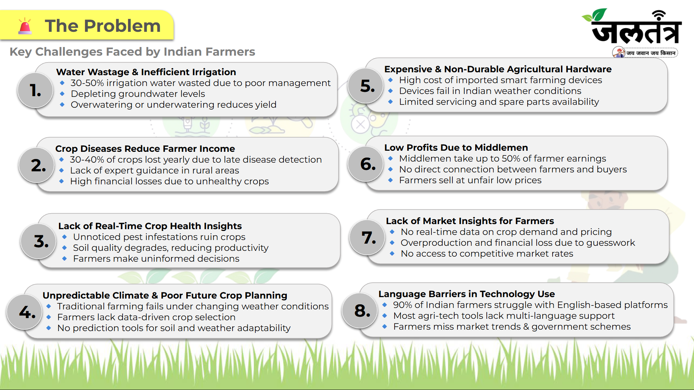
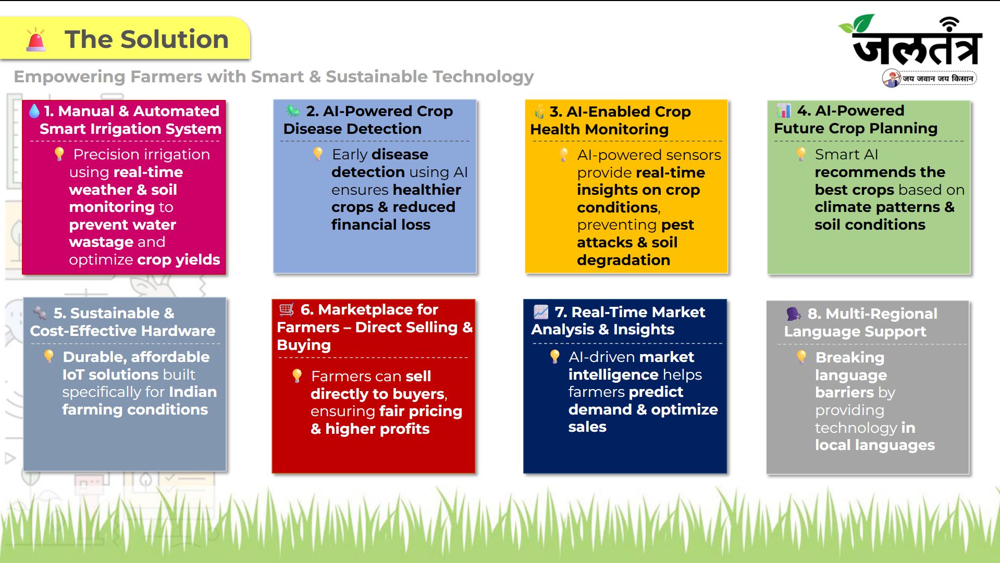

# JalTantra

Smart, Green, and Grounded – Empowering Farmers with Technology for Tomorrow

---

## 🚀 Overview
JalTantra is a modern, smart irrigation and agri-tech platform designed to revolutionize Indian agriculture. It combines IoT, AI, and real-time analytics to help farmers save water, increase crop yield, and connect directly to markets – all in their own language.

---

## 📝 Problem Statement & Solution
### Problem Statement


### Solution


---

## 🌟 Features
- **Smart Irrigation Control** (Automated + Manual)
- **AI-Powered Crop Disease Detection**
- **Live Crop Health Insights**
- **Market Connection** (Direct selling to retailers)
- **Mobile App with Multilingual Support**
- **Future-Ready Planting Suggestions & Growth Analytics**
- **Real-Time Market Analysis & Insights**
- **Multi-Regional Language Support**

---

## 🏗️ Project Structure
```
JalTantra/
├── index.html                # Main landing page
├── Jal-Tantra.pdf            # Project documentation
└── web_jaltantra/
    ├── Final Logo-1.png      # Logo asset
    ├── scripts.js            # Custom JS (interactivity)
    ├── style.css             # Custom CSS (styling)
```

---

## ⚡ Getting Started
1. **Clone the repository**
   ```sh
   git clone https://github.com/kulkarnishub377/JalTantra.git
   ```
2. **Open the project folder** in your code editor (VS Code recommended).
3. **Run locally**
   - Open `index.html` in your browser.
   - All assets are local; no build step required.

---

## 🖥️ Tech Stack
- **HTML5, CSS3, JavaScript**
- **Tailwind CSS** (CDN)
- **Bootstrap 5** (CDN)
- **Bootstrap Icons** (CDN)
- **Google Fonts**

---

## 📊 Stats
- **Liters Water Saved:** 1,200,000+
- **Farmers Helped:** 3,500+
- **Coverage Area:** 180+ sq km

---

## 👥 Team
- Shubham Kulkarni – Founder & CEO
- Aniket Gudgal – Co-Founder
- Yadnyesh Dhangar – Co-Founder
- Mr. Sarim Moin – Advisor (Innovation Officer, MoE’s Innovation Cell)

---

## 📞 Contact
- **Email:** [contact@jaltantra.in](mailto:contact@jaltantra.in)
- **LinkedIn:** [JalTantra LinkedIn](#)
- **Instagram:** [JalTantra Instagram](#)
- **WhatsApp:** [JalTantra WhatsApp](#)

---

## 📄 License
This project is for demonstration and educational purposes. All rights reserved © 2025 JalTantra.

---

## 🌱 Contributing
We welcome ideas, feedback, and collaboration! Please open an issue or contact us for partnership opportunities.

---

## 📝 Documentation
See `Jal-Tantra.pdf` for detailed project documentation, architecture, and future roadmap.

---

## 🙏 Acknowledgements
Thanks to all farmers, mentors, and supporters who inspire innovation in agriculture.

---

## ⭐ Demo
Want to pilot JalTantra in your region? [Request a Demo](#contact) via the contact form on our website.
